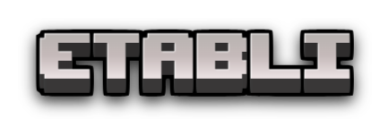

<div id="top"></div>

[![Contributors][contributors-shield]][contributors-url]
[![Forks][forks-shield]][forks-url]
[![Stargazers][stars-shield]][stars-url]
[![Issues][issues-shield]][issues-url]
[![MIT License][license-shield]][license-url]
[![Code coverage][coverage-shield]][coverage-url]

<!-- PROJECT LOGO -->
<br />
<div align="center">
  <a href="https://github.com/floriaaan/etabli">
    
  </a>
  <p align="center">
    Etabli is a Minecraft remake in Typescript, with built-in feature such as mod loading, web server, auto save and more.
    <br />
    <a href="https://github.com/floriaaan/etabli"><strong>Explore the docs »</strong></a>
    <br />
    <br />
    <a href="https://github.com/floriaaan/etabli">View Demo</a>
    ·
    <a href="https://github.com/floriaaan/etabli/issues">Report Bug</a>
    ·
    <a href="https://github.com/floriaaan/etabli/issues">Request Feature</a>
  </p>
</div>

<!-- TABLE OF CONTENTS -->
<details>
  <summary>Table of Contents</summary>
  <ol>
    <li>
      <a href="#about-the-project">About The Project</a>
      <ul>
        <li><a href="#built-with">Built With</a></li>
      </ul>
    </li>
    <li>
      <a href="#getting-started">Getting Started</a>
      <ul>
        <li><a href="#prerequisites">Prerequisites</a></li>
        <li><a href="#installation">Installation</a></li>
      </ul>
    </li>
    <li><a href="#roadmap">Roadmap</a></li>
    <li><a href="#contributing">Contributing</a></li>
    <li><a href="#license">License</a></li>
  </ol>
</details>

<!-- ABOUT THE PROJECT -->

## About The Project

[![Product Name Screen Shot][product-screenshot]](https://github.com/floriaaan/etabli)

### Built With

- [![Typescript][typescript]][ts-url]
- [![React][react]][react-url]

<p align="right">(<a href="#top">back to top</a>)</p>

<!-- GETTING STARTED -->

## Getting Started

This is an example of how you may give instructions on setting up your project locally.
To get a local copy up and running follow these simple example steps.

### Installation


1. Clone the repo
   ```sh
   git clone https://github.com/floriaaan/etabli.git
   ```
2. Install NPM packages
   ```sh
   npm install
   ```
3. Customize your config in `config.ts`

4. Build app
   ```sh
   npm run build
   ```

5. Launch Etabli server
   ```sh
   npm run start
   ```
   

<p align="right">(<a href="#top">back to top</a>)</p>

<!-- ROADMAP -->

## Roadmap

- [ ] Add web server feature
- [ ] Add mod loader support
- [ ] Add core
  - [ ] Entity interfaces
  - [ ] Player interfaces
  - [ ] Item interfaces
  - [ ] Block interfaces

See the [open issues](https://github.com/floriaaan/etabli/issues) for a full list of proposed features (and known issues).

<p align="right">(<a href="#top">back to top</a>)</p>

<!-- CONTRIBUTING -->

## Contributing

Contributions are what make the open source community such an amazing place to learn, inspire, and create. Any contributions you make are **greatly appreciated**.

If you have a suggestion that would make this better, please fork the repo and create a pull request. You can also simply open an issue with the tag "enhancement".
Don't forget to give the project a star! Thanks again!

1. Fork the Project
2. Create your Feature Branch (`git checkout -b feature/amazing-feature`)
3. Commit your Changes (`git commit -m 'feat: add amazing feature'`)
4. Push to the Branch (`git push origin feature/amazing-feature`)
5. Open a Pull Request

<p align="right">(<a href="#top">back to top</a>)</p>

<!-- LICENSE -->

## License

Distributed under the AGPL 3.0 License. See `LICENSE` for more information.

<p align="right">(<a href="#top">back to top</a>)</p>

<!-- MARKDOWN LINKS & IMAGES -->
<!-- https://www.markdownguide.org/basic-syntax/#reference-style-links -->

[contributors-shield]: https://img.shields.io/github/contributors/floriaaan/etabli.svg
[contributors-url]: https://github.com/floriaaan/etabli/graphs/contributors
[forks-shield]: https://img.shields.io/github/forks/floriaaan/etabli.svg
[forks-url]: https://github.com/floriaaan/etabli/network/members
[stars-shield]: https://img.shields.io/github/stars/floriaaan/etabli.svg
[stars-url]: https://github.com/floriaaan/etabli/stargazers
[issues-shield]: https://img.shields.io/github/issues/floriaaan/etabli.svg
[issues-url]: https://github.com/floriaaan/etabli/issues
[license-shield]: https://img.shields.io/github/license/floriaaan/etabli.svg
[license-url]: https://github.com/floriaaan/etabli/blob/master/LICENSE
[coverage-shield]: https://codecov.io/gh/floriaaan/etabli/branch/develop/graph/badge.svg?token=140LKRPY5O
[coverage-url]: https://github.com/floriaaan/etabli/
[product-screenshot]: ./docs/images/screenshot.png
[next.js]: https://img.shields.io/badge/next.js-000000&logo=nextdotjs&logoColor=white
[next-url]: https://nextjs.org/
[react]: https://img.shields.io/badge/React-20232A&logo=react&logoColor=61DAFB
[react-url]: https://reactjs.org/
[typescript]: https://img.shields.io/badge/Typescript-20232A&logo=typescript&logoColor=3178C6
[ts-url]: https://www.typescriptlang.org/
