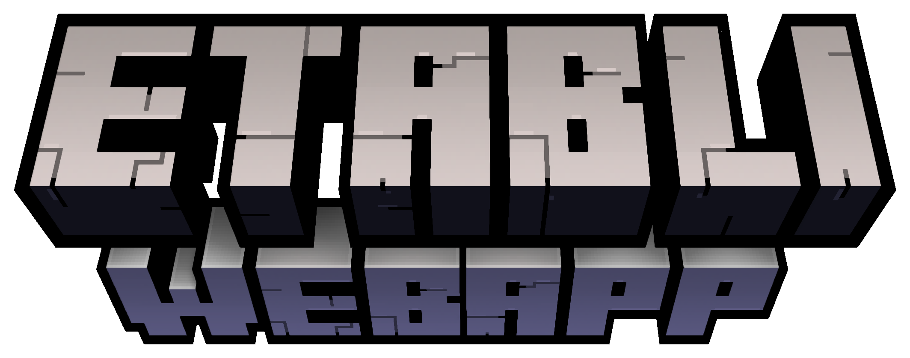

  
  

    Etabli WebApp is an addon to Etabli game, providing status on the host server.
     
    <a href="https://github.com/floriaaan/etabli"><strong>Explore the docs »</strong></a>
     
     
    <a href="https://github.com/floriaaan/etabli">View Demo</a>
    ·
    <a href="https://github.com/floriaaan/etabli/issues">Report Bug</a>
    ·
    <a href="https://github.com/floriaaan/etabli/issues">Request Feature</a>
  

